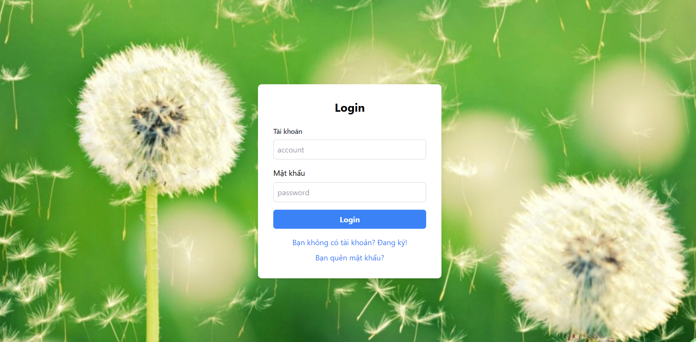
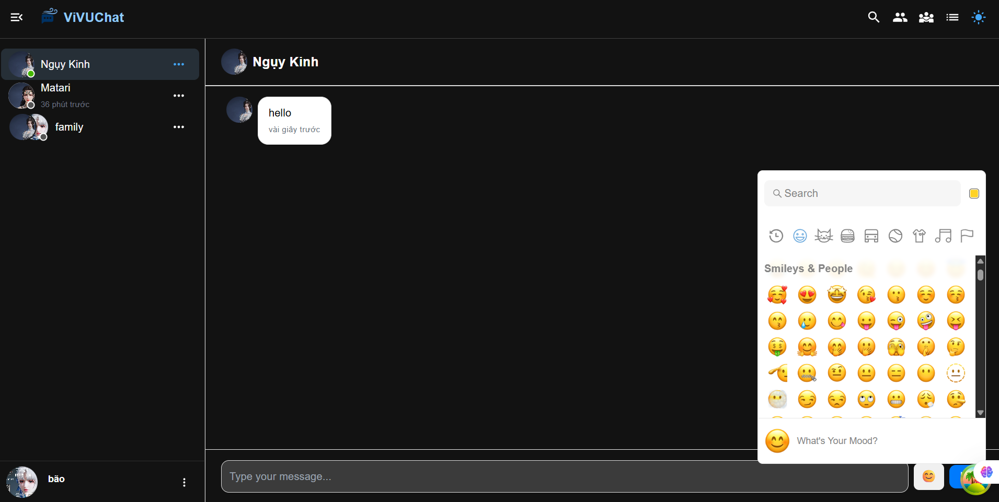
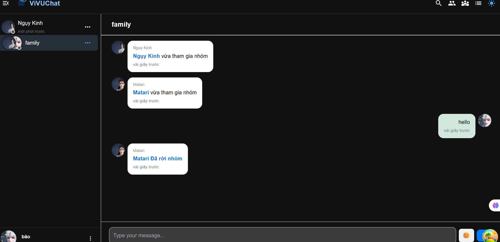
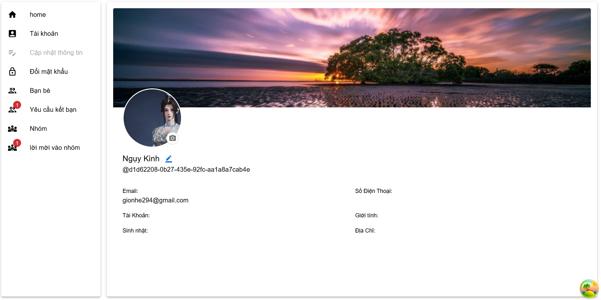

# 💬 VivuWord - Ứng dụng Chat Thời Gian Thực

**VivuWord** là một ứng dụng nhắn tin hiện đại, thời gian thực, được xây dựng bằng ReactJS và các công nghệ web mạnh mẽ. Ứng dụng hỗ trợ chat cá nhân, chat nhóm, gửi emoji, quản lý bạn bè và hồ sơ người dùng – tất cả trong một giao diện mượt mà và trực quan.

---

## 🚀 Tính Năng Nổi Bật

* **Đang ký tài khoản miễn phí**: tạo tài khoản bằng email và mã otp, thay đổi mật khẩu, quên mật khẩu
* **Gửi/nhận tin nhắn thời gian thực**
* **Quản lý bạn bè**: gửi lời mời, chấp nhận, từ chối, hủy kết bạn
* **trò chuyện trực tuyến**: tạo và xóa cuộc hội thoại
* **trò chuyện nhóm**: tạo nhóm, thêm thành viên, rời nhóm, giải tán nhóm
* **Gửi emoji**
* **Tìm kiếm người dùng & kết bạn** : gửi kết bạn,chấp nhận, từ chối
* **Thông báo thời gian thực**
* **Giao diện đẹp, responsive, hỗ trợ light/dark mode**

---

## 🧱🏼‍💻 Kiến Trúc Công Nghệ

| Công Nghệ         | Mục Đích                       |
| ----------------- | ------------------------------ |
| ReactJS           | Xây dựng giao diện             |
| React Router      | Điều hướng trang SPA           |
| React Query       | Quản lý dữ liệu bất đồng bộ    |
| Redux Toolkit     | Quản lý state toàn cục         |
| Socket.IO Client  | Kết nối thời gian thực         |
| React Hook Form   | Quản lý và validate form       |
| Yup               | Xác thực dữ liệu form          |
| MUI (Material UI) | Giao diện hiện đại & linh hoạt |
| Axios             | Gọi REST API                   |
| emoji-picker      | Thêm emoji vào tin nhắn        |

---

## 📁 Cấu Trúc Thư Mục

```bash
src/
├── assets/             # Hình ảnh, icon, file tĩnh
├── hooks/              # Custom hooks
├── router/             # Cấu hình routing
├── services/           # Gọi API qua axios
├── store/              # Redux store & slices
├── types/              # Kiểu TypeScript chung
├── utils/              # Tiện ích chung
├── views/              # Thành phần giao diện 
├── App.tsx             # Component gốc
└── index.tsx            # Điểm khởi chạy React app
```

---

## ⚙️ Cài Đặt & Chạy Ứng Dụng

### 1. Clone Dự Án

```bash
git clone https://github.com/DaoNguyen2941/app-chat-react.git
cd app-chat-react
```

### 2. Cài Dependencies

```bash
npm install
# hoặc
yarn install
```

### 3. Tạo file `.env`

```env
REACT_APP_API_URL=http://localhost:3001
REACT_APP_SOCKET_URL=http://localhost:3001
```

> 🔐 Nếu dùng backend của bạn, cập nhật URL API/SOCKET tương ứng.

### 4. Chạy Ứng Dụng

```bash
npm run start
```

Truy cập tại: [http://localhost:3000](http://localhost:3000)

---

## 🥪 Scripts Hữu Ích

```bash
npm run start        # Chạy development server
npm run build      # Build production
```


## 🐳 Build container (Docker)
vì không copy .env khi đóng gói dự án bàng docker nên cần cung cấp thêm REACT_APP_API_URL và REACT_APP_SOCKET_URL

1. Build image
   
```bash
docker build \
  --build-arg REACT_APP_API_URL="<YOUR_API_URL>" \
  --build-arg REACT_APP_SOCKET_URL="<YOUR_SOCKET_URL>" \
  -t <YOUR_DOCKER_IMAGE_NAME> .
```

Ví dụ chạy local

```bash
docker build \
  --build-arg REACT_APP_API_URL="http://localhost:3001" \
  --build-arg REACT_APP_SOCKET_URL="http://localhost:3001" \
  -t chat-frontend:dev .
```

1. Run container
   
```bash
docker run -p 3000:80 chat-frontend:dev
```

## 📦 Backend Gợi Ý

backend tương thích:

> 🔧 [app-chat-nestjs Backend (NestJS)](https://github.com/DaoNguyen2941/app-chat-nestjs.git) *(tùy chọn)*

---

## 📸 Một Số Hình Ảnh








---

## 📜 Giấy Phép

Dự án được phát hành theo giấy phép MIT. Bạn được phép sử dụng, sửa đổi và triển khai ứng dụng với mục đích tham khảo.

---

## 📧 Liên Hệ

> 📬 Email: [daonguyen2941@gmail.com](mailto:daonguyen2941@gmail.com)  
> 👥 GitHub: [@DaoNguyen2941](https://github.com/DaoNguyen2941)

---

**VivuWord – Trải nghiệm chat hiện đại, kết nối tức thì.**
